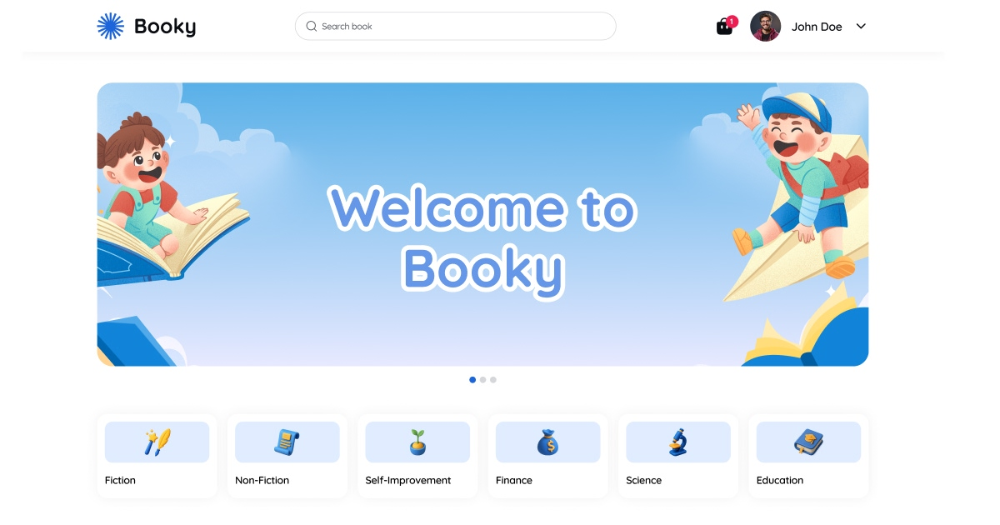

# Booky Library App

[](https://nextjs.org/)
[](https://react.dev/)
[](https://tailwindcss.com/)
[](https://www.typescriptlang.org/)
[](https://opensource.org/licenses/MIT)



[**🌐 Live Demo →**](https://booky-library-app.vercel.app)


A modern, high-performance digital library management system built with the latest web technologies. **Booky** allows users to discover, borrow, and review books while providing a robust administration dashboard for library management.

---

## ✨ Features

- **🛍️ Discovery & Search**: Advanced book search with debouncing and category filtering.
- **🛒 Borrowing System**: Full checkout workflow for borrowing digital/physical resources.
- **👤 User Profiles**: Manage personal borrowing history, reviews, and account settings.
- **📊 Admin Dashboard**: Comprehensive management of books.
- **🌓 Modern UI**: Responsive design with Dark/Light mode support using Tailwind CSS v4.
- **⚡ Performance First**: Powered by React 19 and the new React Compiler for optimal rendering.

---

## 🛠️ Tech Stack

- **Framework**: [Next.js 16](https://nextjs.org/) (App Router)
- **Library**: [React 19](https://react.dev/)
- **Styling**: [Tailwind CSS v4](https://tailwindcss.com/) & [Radix UI](https://www.radix-ui.com/)
- **State Management**: [Redux Toolkit](https://redux-toolkit.js.org/) & [TanStack Query v5](https://tanstack.com/query/latest)
- **Forms**: [React Hook Form](https://react-hook-form.com/) & [Zod](https://zod.dev/)
- **Icons**: [Lucide React](https://lucide.dev/) & [Iconify](https://iconify.design/)
- **Linting & Formatting**: ESLint & Prettier

---

## 🚀 Quick Start

### Prerequisites

- **Node.js** 20.x or higher
- **npm** or **bun** (preferred for speed)

### Installation

1. **Clone the repository**

   ```bash
   git clone https://github.com/miftawidaya/booky-library-app.git
   cd booky-library-app
   ```

2. **Install dependencies**

   ```bash
   npm install
   # or
   bun install
   ```

3. **Set up environment variables**

   ```bash
   cp .env.example .env.local
   ```

   _Edit `.env.local` and add your specific API endpoints._

4. **Run the development server**
   ```bash
   npm run dev
   # or
   bun dev
   ```

Open [http://localhost:3000](http://localhost:3000) with your browser to see the result.

---

## 🔐 Environment Variables

The application requires the following environment variables to function correctly:

| Variable                       | Description                        | Default / Example                |
| :----------------------------- | :--------------------------------- | :------------------------------- |
| `NEXT_PUBLIC_API_URL`          | Base URL for the backend API       | `https://api.example.com/api/v1` |
| `NEXT_PUBLIC_APP_URL`          | Frontend application URL           | `http://localhost:3000`          |
| `NEXT_PUBLIC_GSC_VERIFICATION` | Google Search Console verification | `your-code`                      |

---

## 📁 Project Structure

```bash
src/
├── app/              # Next.js App Router (Routes & Layouts)
│   ├── (admin)/      # Admin dashboard routes
│   ├── (auth)/       # Authentication (Login/Register)
│   ├── (public)/     # Public pages (Home, Books, Search)
│   └── (user)/       # User-specific pages (Profile, Borrowed)
├── components/       # Shared UI & Layout components
├── features/         # Domain-driven feature modules
├── hooks/            # Custom React hooks
├── lib/              # Utility functions, Redux store, & Axio config
├── styles/           # Global styles & Tailwind entry points
└── types/            # TypeScript definitions
```

---

## 🛠️ Scripts

- `npm run dev`: Starts the development server.
- `npm run build`: Builds the application for production.
- `npm run start`: Starts the production server.
- `npm run lint`: Runs ESLint for code quality checks.

---

## 🤝 Contributing

Contributions are what make the open source community such an amazing place to learn, inspire, and create. Any contributions you make are **greatly appreciated**.

1. Fork the Project
2. Create your Feature Branch (`git checkout -b feature/AmazingFeature`)
3. Commit your Changes (`git commit -m 'Add some AmazingFeature'`)
4. Push to the Branch (`git push origin feature/AmazingFeature`)
5. Open a Pull Request

---

## 📄 License

Distributed under the MIT License. See `LICENSE` for more information.

---

Built with ❤️ for the Developer Community.
